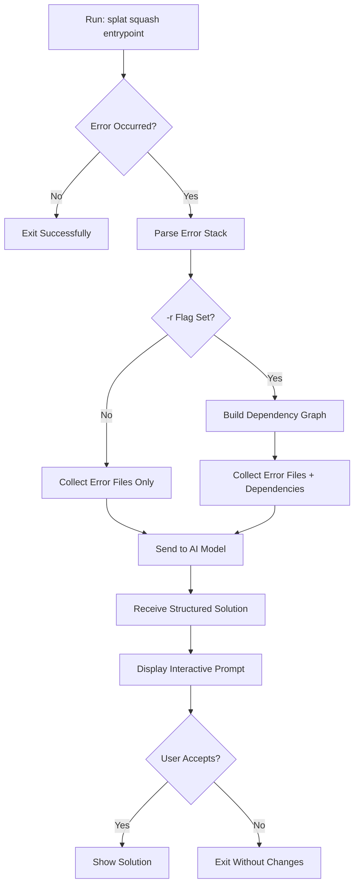

## Overview

Splat provides a streamlined command-line interface for AI-powered debugging. The primary command `splat squash` analyzes runtime and compile-time errors, gathering contextual information to deliver intelligent fixes.

## Primary Commands

### `splat squash`

The main command for analyzing and debugging errors in your code.

<CodeGroup>
```bash Basic Usage
splat squash "python3 app.py"
```

```bash With Relational Context
splat squash -r "python3 main.py"
```

```bash Go Application
splat squash "go run main.go"
```

```bash Node.js Application
splat squash "node index.js"
```
</CodeGroup>

#### Syntax

```bash
splat squash [FLAGS] <ENTRYPOINT>
```

<ParamField path="ENTRYPOINT" type="string" required>
  The command used to run your application. This should be the exact command you would normally use to execute your program.
  
  **Examples:**
  - `"python3 filename.py"`
  - `"node app.js"`
  - `"go run main.go"`
  - `"cargo run"`
</ParamField>

<ParamField path="FLAGS" type="string">
  Optional flags to modify Splat's behavior. See the [Flags documentation](/usage/flags) for details.
</ParamField>

#### How It Works

<Steps>
  <Step title="Execute Your Application">
    Splat runs your application in a contained environment and captures any errors that occur.
  </Step>
  
  <Step title="Parse Error Stack">
    When an error is detected, Splat parses the traceback to identify all files involved in the error chain.
    
    Source: `relational.py:14-20`, `utils.py:47-74`
  </Step>
  
  <Step title="Gather Context">
    Depending on flags used, Splat collects relevant file content:
    - **Default**: Only files mentioned in the error stack
    - **With `-r` flag**: Files in error stack plus all their dependencies (Nth-degree connections)
    
    Source: `relational.py:25-30`
  </Step>
  
  <Step title="AI Analysis">
    Splat sends the error information and file context to Groq's AI model for analysis.
    
    Source: `process/process.py:10-39`
  </Step>
  
  <Step title="Present Solution">
    The AI returns a structured response with:
    - Error location (file and line number)
    - Error type and description
    - Suggested code fix
    
    Source: `terminalout/terminal.py:12-77`
  </Step>
</Steps>

#### Return Format

When an error is detected, Splat provides a structured response:

<CodeGroup>
```json AI Response Structure
{
  "where": {
    "repository_path": "/absolute/path/to/repo",
    "file_name": "app.py",
    "line_number": "42"
  },
  "what": {
    "error_type": "SyntaxError",
    "description": "'(' was never closed"
  },
  "how": {
    "error_origination": "42",
    "suggested_code_solution": "print(hello)"
  }
}
```
</CodeGroup>

Source: `process/process.py:24-26`

<Note>
  Splat currently supports files that can be launched from the root directory of your project. Running sub-module entrypoints from nested directories may not work as expected.
</Note>

### Interactive Review

After Splat analyzes the error, you'll be presented with an interactive prompt:

```bash
🔎 Details about error
✅ We found the first instance of the error at line 42.
✅ The owner of the error: app.py.
✅ The type of the error: SyntaxError.
✅ Isolated error message: '(' was never closed

See suggested change? ... Yes / No
```

<Accordion title="Navigating the Interactive Prompt">
  Use keyboard controls to review and apply fixes:
  
  - **Left Arrow**: Select "Yes" to see and apply the suggested fix
  - **Right Arrow**: Select "No" to skip applying changes
  - **Enter**: Confirm your selection
  
  Source: `terminalout/terminal.py:26-70`
</Accordion>

## Error Handling

### No Error Detected

If your application runs successfully without errors:

```bash
$ splat squash "python3 app.py"
# Application runs normally, Splat exits quietly
```

Source: `relational.py:14-16`

### Missing Entrypoint

<Warning>
  If you run `splat squash` without providing an entrypoint, Splat will prompt you to provide one. Always include your entrypoint command in quotes.
</Warning>

```bash
# ❌ Incorrect
splat squash

# ✅ Correct
splat squash "python3 main.py"
```

### File Not Found

If the entrypoint file doesn't exist:

```bash
$ splat squash "python3 nonexistent.py"
# Error: python3: can't open file 'nonexistent.py'
```

## Command Workflow



## Advanced Usage

### Debugging Multi-File Projects

For complex projects with multiple dependencies:

```bash
# Use -r flag to gather all related files
splat squash -r "python3 app.py"
```

This builds an adjacency list of imports and includes all connected files in the analysis.

Source: `utils.py:130-189`

### Framework-Specific Commands

Splat works with any language or framework:

<Tabs>
  <Tab title="Python">
    ```bash
    splat squash "python3 main.py"
    splat squash -r "python manage.py runserver"  # Django
    splat squash -r "flask run"  # Flask
    splat squash -r "uvicorn main:app"  # FastAPI
    ```
  </Tab>
  
  <Tab title="JavaScript/TypeScript">
    ```bash
    splat squash "node app.js"
    splat squash "npm start"  # React, Next.js
    splat squash "yarn dev"
    ```
  </Tab>
  
  <Tab title="Go">
    ```bash
    splat squash "go run main.go"
    splat squash -r "go run cmd/server/main.go"
    ```
  </Tab>
  
  <Tab title="Rust">
    ```bash
    splat squash "cargo run"
    splat squash -r "cargo run --bin myapp"
    ```
  </Tab>
</Tabs>

<Tip>
  Always wrap your entrypoint in quotes, especially if it contains spaces or flags.
</Tip>

## Git Integration

<Note>
  Splat automatically respects your `.gitignore` file, ensuring that sensitive information and unnecessary files are excluded from the context sent to the AI model.
</Note>

This prevents:
- Environment files (`.env`, `.env.local`)
- Credentials and API keys
- Build artifacts and dependencies
- Other ignored files

From being included in the analysis.

## See Also

- [Flags Reference](/usage/flags) - Detailed explanation of all command-line flags
- [Usage Examples](/usage/examples) - Real-world scenarios and solutions
